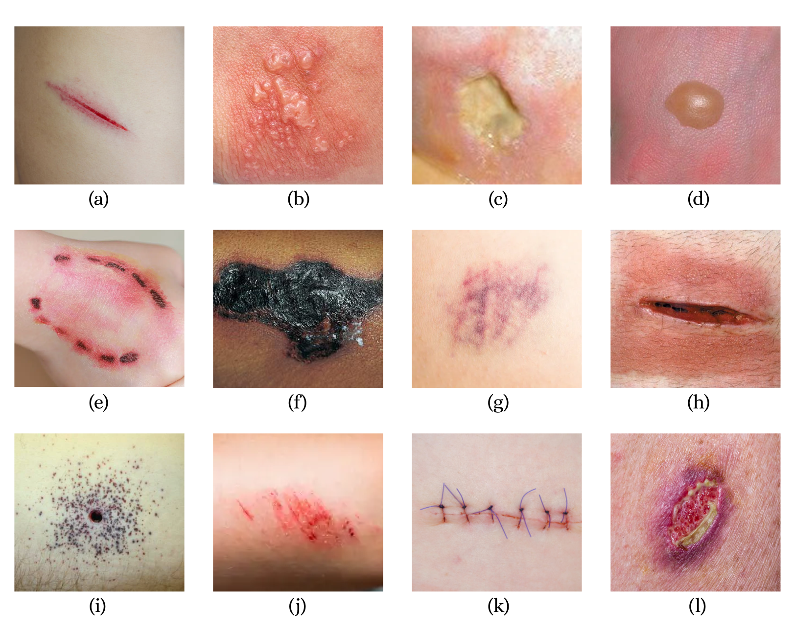

###### EN

# Computer Vision for Automatic Classification of Wounds with YOLOv8 Neural Network

JOHNNY CLEITON WILLY DA SILVA  
ADRIEN DURAND-PETITEVILLE (academic advisor)  
JONAS FERREIRA SILVA (technical advisor)

This work investigates the application of the YOLOv8 algorithm for the detection and classification of wounds in digital images, highlighting the potential of artificial intelligence in improving medical diagnostics. By leveraging YOLOv8's efficiency in object detection, the study aims to enhance precision and effectiveness in wound identification, addressing challenges posed by acute and chronic wounds in healthcare. The neural network is trained on extensive datasets and tested on various images and videos, demonstrating its capability to accurately localize and classify wounds.

## MOTIVATION

*Use the YOLOv8 algorithm for wound detection and classification based on cause.*

### Usage scenarios

- Self-treatment
- Early detection of complications
- Telemedicine

## BACKGROUND

**Computer Vision (CV)** empowers computers to interpret visual information, simulating human image processing, with applications across medicine, automation, security, and more. This field involves developing algorithms for tasks like image classification, where systems assign labels to objects based on probabilities, akin to human visual categorization. Additionally, CV encompasses localization, determining objects' precise positions using bounding boxes, and detection, identifying multiple objects and their locations. This work focuses on classification and localization, highlighting their importance in accurately understanding and identifying specific elements within images.

<section>
  

    
    
  

</section>

**The YOLO (You Only Look Once)** framework is notable for its balance between speed and accuracy in object detection, outperforming traditional methods like R-CNN by performing detection in a single neural network pass. This efficiency makes YOLO faster and more computationally effective. Among its eight versions, YOLOv8, released by Ultralytics in January 2023, includes five scaled models—YOLOv8n, YOLOv8s, YOLOv8m, YOLOv8l, and YOLOv8x—each tailored to different applications and hardware needs. This work specifically uses YOLOv8 for enhanced detection and classification tasks.

<section>
  

      
  

</section>

**Biological Classification of Wounds** - a wound disrupts the skin or mucous membrane, often damaging underlying tissues, and can be caused by various factors. The healing process aims to restore tissue integrity. Wounds are classified based on factors like origin, depth, extent, and infection presence, and can be identified visually and through biological indicators. Figure 6 illustrates various wound shapes.

<section>
  

    
  

</section>

Dermal wounds can be categorized into three main types: surgical, pathological, and traumatic. Surgical wounds result from planned medical procedures in sterile environments, minimizing infection risks. Pathological wounds, such as pressure ulcers and diabetic ulcers, are linked to underlying medical conditions and classified by the presence of infection and contamination. Traumatic wounds occur from accidents or impacts, classified based on contamination and injury severity, with a focus on preventing secondary infections.

<section>
  

    
  

</section>

## METHODOLOGY

### Dataset and Labeling

To train YOLOv8, a dataset of 837 images was used, comprising 223 images of surgical wounds, 253 images of pathological wounds, and 361 images of traumatic wounds. The data was split into 70% for training (585 images), 15% for validation (125 images), and 15% for testing (127 images). Images were labeled with bounding boxes using the Computer Vision Annotation Tool (CVAT) and organized into "train", "val", and "test" folders. The dataset combined four sources from the Roboflow platform, with all images sized at 640x640 pixels and already augmented.

<section>
  

    
    
  

</section>

### Training with YOLOv8

The implementation of YOLOv8 began in the Google Colab environment using an NVIDIA Tesla T4 GPU. Initially, all wound images were labeled as a single class called "wound" to train the algorithm for general wound detection. Subsequently, images were relabeled into three classes: "surgical," "pathological," and "traumatic," for specific classification and localization. Due to the small dataset size, the Nano version (YOLOv8n) was used, and training was conducted over four different epochs: 5, 20, 50, and 80.

<section>
  

    
  

</section>

## RESULTS

Training the wound classification and localization network for a single class ("wound") yielded satisfactory results after 50 epochs, with accurate localization achieved through a single bounding box. Earlier epochs generated multiple bounding boxes for one detection, highlighting the impact of epoch number on model refinement.

<section>
  

    
    
  

</section>

The classification with 5 epochs shows erroneous recognition of the "background," where objects besides wounds were misclassified as wounds. Furthermore, some wounds were not recognized, indicating insufficient learning within the model.

The result for training with only one class (wounds) was also applied in video, which can be seen [here](https://drive.google.com/file/d/15a2ynl4zlg0zOkzjLKAjqTTSABwD6gRu/view?usp=sharing).

### Classification of Wounds with Three Classes

Training the neural network for three different classes of wounds resulted in a satisfactory, albeit not ideal, outcome after 20 epochs. Wounds were classified correctly, as depicted in Figure 12, where neural network predictions for pathological, surgical, and traumatic classes with 50 epochs are presented. Figure 13 illustrates a test image comparison between training with 5 epochs and 50 epochs, revealing erroneous classification of a pathological wound as a traumatic wound with 5 epochs.

<section>
  

    
    
  

</section>

The confusion matrix from training with 50 epochs indicates that no class achieved 100% correct predictions. Notably, 44% of surgical wound images were incorrectly classified as "background," along with 24% of pathological wound images and 32% of traumatic wound images. Additionally, there were incorrect classifications between wound classes, with 4% of traumatic wounds misjudged as pathological wounds. These findings underscore the necessity for a more comprehensive dataset with greater image variation to improve training accuracy.

<section>
  

    
  

</section>

## CONCLUSION

If you want to access the full study and know the references used, you can read the [article](https://github.com/johnnycleiton07/classification-of-wounds/blob/main/article/Johnny_Cleiton___Computer_Vision_for_Automatic_Classification_of_Wounds_with_YOLOv8_Neural_Network.pdf).
